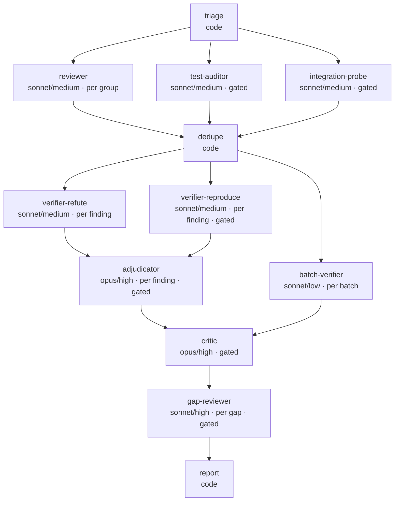

# Zero-Trust Review

Strict review of **only the changes in the current branch diff against the target branch**. Assume nothing; ambiguity, omission and unstated assumptions are blockers until proven otherwise. A hazard in untouched code is **not** a finding unless the diff newly routes traffic through it; say so instead of padding.

It runs as an **execution graph** ([`graph.mjs`](./graph.mjs)) executed by [`workflow.js`](./workflow.js). The lead gathers facts with plain code ([`triage.py`](./triage.py)); the 30-point audit lives in [`checklist.md`](./checklist.md) and agents Read only their own points. Related: `code-review` (standards + spec), `security-review` (escalate when point 6 or 7 finds a real flaw). This skill owns **production-hazard and test-integrity review**.

**Requires:** Node 18+ (`graph.mjs`, `workflow.js`), python3 (`triage.py`, stdlib only), git, glab, jq, and GNU `timeout` (without it probes degrade to `unverifiable`).

**Terms:** *lead* = the session that coordinates; *driver* = a finding agent (`reviewer`, `gap-reviewer`); *navigator* = a verifying agent (`verifier-*`, `batch-verifier`); *finding* = one defect a driver files; *cluster* = findings merged by `dedupe`, the unit that gets verified.

Cost levers: disjoint groups, gated points, checklist by pointer, plain-code dedupe, tiered verification, scoped tests run once, checkpoints (a full-fleet design cost 95 agents per run; figures in [`runs.md`](./runs.md)). **Do not reach for `deep` or extra verifiers reflexively.**

## Progress checklist

Copy and tick off:

```
- [ ] 0 Triage: mode chosen, plan shown (confirm if > 25 agents)
- [ ] 1 Context: ticket, decisions, prior, scoped test + lint facts
- [ ] 2 Run Workflow; read the compact return only
- [ ] 3 Cite permalinks (post only when asked); 3b suggestions
- [ ] 4 Report written to the temp dir, path printed, verdict set
```

## Modes

| Mode | Use when | Runs | Cost class |
|---|---|---|---|
| `quick` | < 150 source lines, <= 5 files | ONE reviewer, whole diff (35 calls); verifies critical/high only | ~3-6 agents |
| `standard` | default | reviewer per group, waves of 3 (30 calls); full verification | ~10-20 agents |
| `deep` | > 1500 source lines, > 40 files, auth/payments/migrations, or asked | standard at effort high (45 calls) + test-auditor (scoped runs) + integration-probe (throwaway container; only if 13/18/21 fired) + opus critic + <= 3 gap reviewers | ~20-35 agents |

`triage.py` picks the mode (`standard` unless the quick or deep row matches); `--mode` overrides. Example: a 14-file/825-line diff plans ~14 agents in `standard` (4 reviewers, 5 refuters, 5 batches of lows).

## The graph

<!-- GENERATED:graph -->



<!-- /GENERATED:graph -->

`node graph.mjs --check` prints layers and the critical path and fails on drift; `--write` regenerates this diagram and the node table in `workflow.js`. Each node has its own model, effort and ponytail level (it shortens probes and fixes, never evidence). Protect: finders never wait on each other; verifiers hang off `dedupe`, never a reviewer; `verifier-reproduce` runs beside `verifier-refute`.

## Lead-only rule

The lead only coordinates (triage, facts, Workflow launch, report). It never reviews inline, reads the whole diff or re-verifies a finding itself; one fully understood one-line fix is the only exception.

## The lead gathers deterministic facts

| Fact | Command (lead, ONCE) |
|---|---|
| `git diff --stat`, groups, points, mode, drift | `python3 triage.py --base origin/<target>` after `git fetch -q origin <target>` (a stale local base yields thousands of false files) |
| Tests for the changed paths | the project's test command, scoped to the changed tests and modules; never the whole suite |
| Lint | `pre-commit run --files <changed>`; never `--all-files` |

Prepend one line each for tests and lint to `facts` and pass it **verbatim** (reviewers see the first ~800 chars). Agents judge these facts; they never re-run them.

## Driver/navigator contract for review

The reviewer is the **driver**: it files findings for its group's points, told an independent navigator will try to refute each. Verifiers are **navigators**, always separate nodes: a model cannot grade its own finding. A navigator gets the finding and the same repo/diff facts, never another navigator's verdict; only the opus adjudicator sees both, and only on a split. Hard fence: findings only in the group's files, repo read-only, probes in `git archive` copies. One unit, one deliverable.

## Verification policy

| Severity | Verification | Cap |
|---|---|---|
| critical / high | `verifier-refute` + `verifier-reproduce` in parallel; `adjudicator` (opus) only if one says real and the other not | 25 each, 20 |
| medium | ONE `verifier-refute`; `verifier-reproduce` only on partial / unverifiable / null | 15 |
| low | `batch-verifier`: one agent per <= 8 lows, one verdict each (effort low) | 25 |
| nit | never verified: `unverified-nit` | - |

`quick` verifies critical/high only; verification runs in waves of 4 clusters. If the review returns nothing >= medium, only the batch of lows runs (logged `EARLY EXIT`). Dedupe is plain code: same file, lines within 3, title-token Jaccard >= 0.34 -> one cluster at the highest severity.

## Resilience

- The harness kills an agent silent for ~180 s and a retry restarts from zero, so every reviewer, auditor and batch verifier keeps a **checkpoint** `$scratch/ck/<sha8>-<mode>/<unit>.jsonl`: `cat` first, append one JSON line per finished point; a retry continues (delete the directory for a fresh opinion).
- **Waves** of 3 reviewers, 4 verifiers: one gateway stall can't take out the fleet. Every agent has a tool-call cap and `timeout 120` on each shell command.
- A **null result is never "no issues"**: it lands in `notReviewed` or is marked `unverified`; a non-empty `notReviewed` rules out `APPROVE`.
- **Resume** with `Workflow({ scriptPath, resumeFromRunId })`; completed agents come back cached only if their prompts are byte-identical, so keep `args` unchanged. Check the ck files first: a half-done unit often has findings on disk.

## Keep the lead cheap

The lead is re-billed for its whole context every turn: run from a fresh or compacted session, never paste raw agent output or journals, write the report from the compact return.

## Escalation

Re-run `deep` when a critical/high you mean to block on survives, or `notReviewed` stays non-empty after a resume. Add a second `verifier-reproduce` (different probe) only for a critical you will BLOCK on after an unverifiable first one.

## Iterate the graph from measurements

Models, efforts and caps are a starting guess. After each run append `date | sha8 | mode | agentsByNode | tokens | wall-clock | note (USD if known)` to [`runs.md`](./runs.md). Move one node's model or effort only from those numbers (steps in [`tiering.md`](./tiering.md)). The critical path is the wall-clock floor: shorten it by removing an edge, not with a faster model. Evaluation scenarios: [`evals.json`](./evals.json).

## Tiering

Each node carries a tier (T0 code, T2 sonnet, T3 opus); table and rules R1-R6 are in [`tiering.md`](./tiering.md). Key rules:

- Checker >= maker in model and effort where no one re-reads the miss; exceptions: batch-verifier (low clusters) and deep-mode verifiers (critic re-reads).
- Opus only on once-per-run or gated judges (adjudicator, critic).
- No tool-looping agent above `high`: a silent agent is interrupted at ~180 s; the retry restarts.

## Voice

Everything that reaches GitLab (comments, discussions, summary note) and the report reads as this engineer's own review: direct, technical, specific, zero padding. Never name, hint at or apologize for being an AI, model, assistant, bot or "automated" review. Read [`voice.md`](./voice.md) before writing any of it.

## Step 0 — Triage

```bash
SK=${SK:-~/.claude/skills/zero-trust-review}; CTX=$(mktemp -d)
glab mr view --output json > "$CTX/mr.json" 2>/dev/null
TARGET=$(jq -r '.target_branch // "master"' "$CTX/mr.json"); git fetch -q origin "$TARGET"
python3 $SK/triage.py --base "origin/$TARGET" > "$CTX/triage.json"
node $SK/graph.mjs --plan <mode> <groups> 0 1 5 30   # args after mode: groups, expected critical, high, medium, low
```

Show the user a short summary (mode, groups with lines, fired vs skipped points, drift) and the plan. **If the planned total exceeds 25 agents, confirm with the user before spending.** `--force-all` fires every gated point.

## Step 1 — Gather context

Only what agents cannot get themselves: the Jira card / MR description saved to `$SCRATCH/ticket.md` (`ticket`; a missing one is itself a point-1 finding, review anyway); author-declared decisions to challenge (`decisions`, <= 1.5 KB); an earlier review to re-verify (`prior`, <= 1 KB); the scoped test and lint one-liners for `facts`. Never read the diff yourself.

## Step 2 — Run

`mode: "plan"` (+ `as`) is a dry run: plan and prompt sizes, no agent spawned. Then:

```
Workflow({ scriptPath: "<skillDir>/workflow.js", args: { ...triageJson, repo, sha, scratch, skillDir, ticket, decisions, prior, mode } })
```

`scratch` = the session scratchpad; `sha` defaults to triage `head`; agents Read their points from `checklist.md`. Read the **compact return** only: `{mode, counts, stats, notReviewed, clusters[{id,status,severity,file,startLine,endLine,points,anchorable,title,hazard,failureScenario,suggestedFix,verdicts}], notApplicable, questions, unverified}`. Confirmed critical/high -> Critical Blockers; refuted -> one line; out-of-scope -> refactor MR; unverified/disputed -> Grilling as questions, never as facts.

## Step 3 — Point out the code in GitLab

```bash
WEB=$(jq -r .web_url "$CTX/mr.json"); PROJ=${WEB%%/-/merge_requests/*}
BASE=$(jq -r .diff_refs.base_sha "$CTX/mr.json"); START=$(jq -r .diff_refs.start_sha "$CTX/mr.json"); SHA=$(jq -r .diff_refs.head_sha "$CTX/mr.json")
echo "$PROJ/-/blob/$SHA/path/to/File.kt#L42-58"   # pinned to the reviewed SHA
```

Cite findings as `path:line` | permalink | finding; **do not post** until the user asks to comment on the MR.

**Anchorable** = one file and a line or range on the diff's new side. **Not anchorable** = spans the MR, names a missing artifact (no test file, no description, no CI run on this SHA) or has no single line ("has the flag-OFF path run in staging?"). Never invent a `new_line`; say why there is no anchor.

**Posting:** one resolvable discussion per anchorable finding via the diffs API: `glab api --method POST projects/:id/merge_requests/<iid>/discussions -f body=… -f position[position_type]=text -f position[base_sha]=$BASE -f position[start_sha]=$START -f position[head_sha]=$SHA -f position[new_path]=<file> -f position[new_line]=<n>`. Never one giant note, never two findings in a thread. Body: 1-3 sentences in the Voice, plus a Step 3b suggestion only when the fix is mechanical. Not-anchorable findings go into exactly ONE general note (`glab mr note <iid> -m …`). Mirror the mechanism (inline, on the line), not another tool's chrome (rating buttons, IDE links, hidden payloads, borrowed HTML markers).

## Step 3b — Suggest the fix for a line range, do not describe it

A mechanical fix is an **applyable suggestion block**, not prose; judgment calls stay prose. The fence is `suggestion:-A+B`: `A` lines above and `B` below the anchored line, replaced wholesale. For lines `xx..yy` anchor (`new_line`) at `xx` and `B = yy - xx`: 142-158 -> `-0+16`. Compute it, don't eyeball it.

Before posting or reporting a suggestion, Read [`suggestions.md`](./suggestions.md): span cap, verbatim lines, new side only, no trailing-newline drift, posting and report format.

## Step 4 — Write the report to the OS temp directory

```bash
REPORT="${TMPDIR:-/tmp}/review-$(git rev-parse --abbrev-ref HEAD | tr '/' '-')-$(date +%Y%m%d-%H%M%S).md"
```

`${TMPDIR:-/tmp}` keeps macOS's per-user isolation. Write the report with the Write tool from the compact return and print its absolute path as the last line. Its grouping is independent of Step 3's posting. Sections in order, "None found" rather than padding:

1. **Critical Blockers** — missing requirements, broken edge cases, security flaws, unindexed queries, OOM risk, async leaks, pool starvation, swallowed errors, contract breaks, dual-write bugs, data loss, flaky tests, SIGTERM drops, LLM failure cascades, rollback hazards.
2. **Test Coverage, Integrity and Flakiness** — table: `File/Function` | `Deficit (missing case / flaky / deceptive mock / weakened)` | `Risk`.
3. **Duplication and Reuse** — what was reinvented and the existing helper that covers it.
4. **Production and Operational Readiness** — non-blocking findings from points 9-29, grouped.
5. **Refactoring Recommendations (separate MR)** — concrete split proposals for tech debt.
6. **Grilling and Ambiguities** — point-30 questions and unverified items, addressed to the author.
7. **Minor / Nitpicks**.
8. **Verdict** — `APPROVE` | `REQUEST CHANGES` | `BLOCKED`, plus mode, agent total, skipped points.

Verdict rule: any unresolved Critical Blocker is `BLOCKED`. Findings in sections 2-4 only are `REQUEST CHANGES`. `APPROVE` needs empty sections 1 and 2 **and** an empty `notReviewed`; an unverified or disputed critical/high caps the verdict at `REQUEST CHANGES`.
