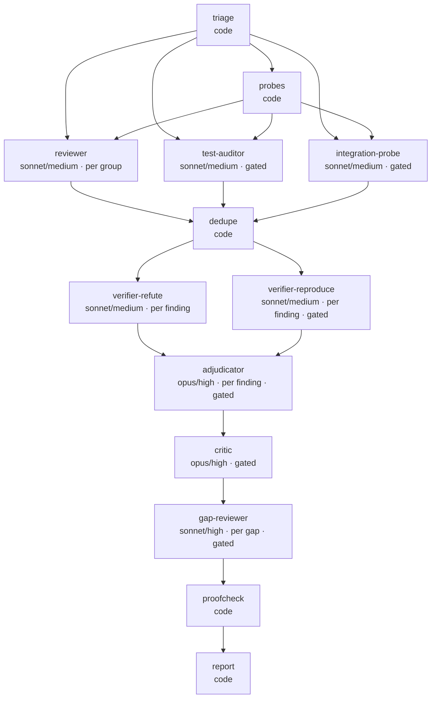

# Zero-Trust Review

Strict review of **only the changes in the current branch diff against the target branch**. Assume nothing; ambiguity, omission and unstated assumptions are blockers until proven otherwise. A hazard in untouched code is **not** a finding unless the diff newly routes traffic through it; say so instead of padding.

It runs as an **execution graph** ([`graph.mjs`](./graph.mjs)) executed by [`workflow.js`](./workflow.js). The lead gathers facts with plain code ([`triage.py`](./triage.py)); the 30-point audit lives in [`checklist.md`](./checklist.md) and agents Read only their own points. Related: `code-review` (standards + spec), `security-review` (escalate when point 6 or 7 finds a real flaw). This skill owns **production-hazard and test-integrity review**.

**Requires:** Node 18+ (`graph.mjs`, `workflow.js`), python3 (`triage.py`, stdlib only), git, and a sandbox for probes (macOS `sandbox-exec` built in, Linux `bwrap`, or docker via `ZT_SANDBOX_IMAGE`); with none, probes are `unverifiable` and never run bare. Optional: the host CLI (`glab` GitLab, `gh` GitHub) plus `jq`, to read CR metadata and post. Without one the skill runs git-only: report only. Per-host commands: [`hosts.md`](./hosts.md).

**Terms:** *change request (CR)* = a GitLab merge request (MR) or GitHub pull request (PR); *lead* = the coordinating session; *driver* = a finding agent (`reviewer`, `gap-reviewer`); *navigator* = a verifying agent (`verifier-*`); *finding* = one defect; *cluster* = findings merged by `dedupe`, the unit verified.

Cost levers: disjoint groups, gated points, checklist by pointer, plain-code dedupe, tiered verification, changed tests run for real once in plain code, checkpoints, few agents (each costs ~45k tokens before it works; figures in [`runs.md`](./runs.md)). **Do not reach for `deep` or extra verifiers reflexively.**

## Progress checklist

Copy and tick off:

```
- [ ] 0 Triage: mode chosen, plan shown (confirm if > 25 agents)
- [ ] 1 Context: ticket, decisions, prior, scoped test + lint facts (host adapter below)
- [ ] 2 Run Workflow; read the compact return only
- [ ] 3 Cite permalinks (post only when asked); 3b suggestions
- [ ] 4 Report written to the temp dir, path printed, verdict set
```

## Modes

| Mode | Use when | Runs | Cost class |
|---|---|---|---|
| `quick` | < 150 source lines, <= 5 files | ONE reviewer, whole diff (35 calls); verifies critical/high only | ~3-6 agents |
| `standard` | default | reviewer per group, waves of 3 (30 calls); full verification | ~10-20 agents |
| `deep` | > 1500 source lines, > 40 files, auth/payments/migrations, or asked | standard at effort high (45 calls) + test-auditor (scoped runs) + integration-probe (throwaway container; only if 13/18/21 fired) + opus critic + <= 3 gap reviewers | ~20-35 agents |

`triage.py` picks the mode (`standard` unless the quick or deep row matches); `--mode` overrides. Example: a 14-file/825-line diff plans ~9 agents in `standard` (4 reviewers, 5 refuters; lows are checked in code). Groups under 150 lines merge.

## The graph

<!-- GENERATED:graph -->



<!-- /GENERATED:graph -->

`node graph.mjs --check` prints layers and the critical path and fails on drift; `--write` regenerates this diagram and the node table in `workflow.js`. Each node has its own model, effort and ponytail level (it shortens probes and fixes, never evidence). Protect: finders never wait on each other; verifiers hang off `dedupe`, never a reviewer; `verifier-reproduce` runs beside `verifier-refute`.

## Lead-only rule

The lead only coordinates (triage, facts, Workflow launch, report). It never reviews inline, reads the whole diff or re-verifies a finding itself; a one-line fix it fully understands is the only exception.

## The lead gathers deterministic facts

| Fact | Command (lead, ONCE) |
|---|---|
| `git diff --stat`, groups, points, mode, drift | `python3 triage.py --base origin/<target>` after `git fetch -q origin <target>` (a stale local base yields thousands of false files) |
| Changed tests, run for real | `node $SK/testprobe.mjs --repo . --base origin/<target> --head HEAD --scratch $SCRATCH/probe --cmd 'pytest -q {file}'` (pass-after, fail-before, flake; [`probes.md`](./probes.md)); never the whole suite |
| Mutants on the changed lines | `mutate.mjs`, same flags (+ `--kill-exits 1` for pytest): a surviving mutant is a test gap with a citable run |
| Lint | the project's linter on the changed files only, e.g. `pre-commit run --files <changed>`, `eslint <changed>`; never whole-repo (`--all-files`, `npm run lint`) |

Run probes and lint concurrently. Prepend the probe and mutation `summary` and one lint line to `facts` and pass it **verbatim** (reviewers see the first ~800 chars). Agents judge these facts; they never re-run them.

## Driver/navigator contract for review

The reviewer is the **driver**: it files findings for its group's points, told an independent navigator will try to refute each. Verifiers are **navigators**, always separate nodes: a model cannot grade its own finding. A navigator gets the finding and the same repo/diff facts, never another navigator's verdict; only the opus adjudicator sees both, and only on a split. Hard fence: findings only in the group's files, repo read-only, probes in `git archive` copies run only through the sandbox. One unit, one deliverable.

## Verification policy

| Severity | Verification | Cap |
|---|---|---|
| critical / high | `verifier-refute` + `verifier-reproduce` in parallel; `adjudicator` (opus) only if one says real and the other not | 25 each, 20 |
| medium | ONE `verifier-refute`; `verifier-reproduce` only on partial / unverifiable / null | 15 |
| low | no agent (an agent costs ~45k tokens before it works): `proofcheck.mjs` re-checks the finding's quote against the real code | - |
| nit | never verified: `unverified-nit` | - |

`quick` verifies critical/high only; each group verifies as soon as its review lands, in one rolling pool of 6 agents, no waves. **No guessing:** a medium+ needs a proof that ran, was read or was measured (`executed|read|log|metric|trace`); a guess is `unproven`, and `proofcheck` re-verifies every ref and quote against real code and ledgers ([`probes.md`](./probes.md)). If the review returns nothing >= medium, no verifier runs (logged `EARLY EXIT`). Dedupe is plain code: same file, lines within 3, similar title -> one cluster at the highest severity.

## Resilience

- The harness kills an agent silent for ~180 s and a retry restarts from zero, so every reviewer and auditor **checkpoints** through `note.mjs`; a dead or null agent is retried once, pointed at its checkpoint and dying note. One rolling pool of 6 agents; repo code runs only through `sandbox-run.mjs`. The run folder `$RUN` (status, tips, notes, ledgers, board, postmortem; all untrusted data) is in [`probes.md`](./probes.md).
- A **null result is never "no issues"**: it lands in `notReviewed` or is marked `unverified`; a non-empty `notReviewed` rules out `APPROVE`.
- **Resume** with `Workflow({ scriptPath, resumeFromRunId })`; completed agents come back cached only if their prompts are byte-identical, so keep `args` unchanged. Check the ck files first: half-done units hold findings.

## Keep the lead cheap

The lead is re-billed for its whole context every turn: use a fresh or compacted session, never paste raw agent output, report from the compact return.

## Escalation

Re-run `deep` when a critical/high you will block on survives, or `notReviewed` stays non-empty after a resume. Add a different-probe `verifier-reproduce` only for a critical you will BLOCK on.

## Iterate the graph from measurements

Models, efforts and caps are a starting guess. After each run append the line from `node measure.mjs <transcriptDir>` to [`runs.md`](./runs.md); move one node's model or effort only from those numbers ([`tiering.md`](./tiering.md)). The critical path is the wall-clock floor: shorten it by removing an edge. Evals: [`evals.json`](./evals.json).

## Tiering

Each node carries a tier (T0 code, T2 sonnet, T3 opus); table and rules R1-R6 are in [`tiering.md`](./tiering.md). Key rules:

- Checker >= maker in model and effort where no one re-reads the miss; exception: deep-mode verifiers (critic re-reads).
- Opus only on once-per-run or gated judges (adjudicator, critic).
- No tool-looping agent above `high`: a silent agent is interrupted at ~180 s; the retry restarts.

## Voice

Everything that reaches the review host (comments, discussions, summary note) and the report reads as this engineer's own review: direct, technical, specific, zero padding. Never name, hint at or apologize for being an AI, model, assistant, bot or "automated" review. Read [`voice.md`](./voice.md) before writing any of it.

## Step 0 — Triage

```bash
SK=${SK:-$HOME/.claude/skills/zero-trust-review}; CTX=$(mktemp -d)   # SK must be an absolute path
RUN=$(node $SK/note.mjs activate --name "$(basename "$PWD")-$(git rev-parse --short=8 HEAD)")   # private run dir in the OS temp dir + per-user marker. Tell the user: tail -f $RUN/status.jsonl
# host CLI -> $CTX/cr.json, set TARGET + SHA (glab mr view --output json | gh pr view --json ...); see hosts.md
TARGET=${TARGET:-main}; git fetch -q origin "$TARGET"
python3 $SK/triage.py --base "origin/$TARGET" --diff-dir "$RUN/diff" > "$CTX/triage.json"   # one patch per group: reviewers Read it instead of many git calls
node $SK/graph.mjs --plan <mode> <groups> 0 1 5 30   # args after mode: groups, expected critical, high, medium, low
```

Show the user a short summary (mode, groups with lines, fired vs skipped points, drift) and the plan. **If the planned total exceeds 25 agents, confirm with the user before spending.** `--force-all` fires every gated point.

## Step 1 — Gather context

Only what agents cannot get themselves: the ticket (Jira, GitHub Issue, Linear, ...) or CR description saved to `$SCRATCH/ticket.md` (`ticket`; a missing one is itself a point-1 finding, review anyway); author-declared decisions to challenge (`decisions`, <= 1.5 KB); an earlier review to re-verify (`prior`, <= 1 KB); the probe summary and lint line for `facts`. Never read the diff yourself.

## Step 2 — Run

`mode: "plan"` (+ `as`) is a dry run: plan and prompt sizes, no agent spawned. Then:

```
Workflow({ scriptPath: "<skillDir>/workflow.js", args: { ...triageJson, repo, sha, scratch, runDir: RUN, skillDir, ticket, decisions, prior, mode } })
```

Then write the return's `boardMd` and `postmortemMd` verbatim to `$RUN/board.md` and `$RUN/postmortem.md` (the postmortem tells the next run what to do and not do). **Step 2b, no guessing:** save the return as `$RUN/return.json`, run `node $SK/proofcheck.mjs --ret $RUN/return.json --repo . --head <sha> --run $RUN`, and report from its adjusted clusters; it writes `$RUN/evidence.md` and `verified.json`. When the review is done, `node $SK/note.mjs deactivate`.

`scratch` = the session scratchpad; `sha` defaults to triage `head`; agents Read their points from `checklist.md`. Read the **compact return** only: `{mode, counts, stats, notReviewed, clusters[{id,status,severity,file,startLine,endLine,points,anchorable,title,hazard,failureScenario,suggestedFix,verdicts}], notApplicable, questions, unverified}`. Confirmed critical/high -> Critical Blockers; refuted -> one line; out-of-scope -> refactor CR; unverified/disputed -> Grilling as questions, never as facts.

## Step 3 — Point out the code on the review host

Cite each finding as `path:line` | permalink pinned to the reviewed SHA | finding. **Do not post** until the user asks to comment on the CR. Before citing or posting, Read [`posting.md`](./posting.md): permalink format per host, anchorable or not, one inline comment per finding, voice.

## Step 3b — Suggest the fix for a line range, do not describe it

A mechanical fix is an **applyable suggestion block**, not prose; judgment calls stay prose. Before posting or reporting one, Read [`suggestions.md`](./suggestions.md): fence per host and its line arithmetic (GitLab `suggestion:-A+B`, GitHub `start_line`/`line`), span cap, verbatim lines, new side only, no trailing-newline drift.

## Step 4 — Write the report to the OS temp directory

```bash
REPORT="${TMPDIR:-/tmp}/review-$(git rev-parse --abbrev-ref HEAD | tr '/' '-')-$(date +%Y%m%d-%H%M%S).md"
```

`${TMPDIR:-/tmp}` keeps macOS's per-user isolation. Write the report with the Write tool from the compact return and print its absolute path as the last line. Its grouping is independent of Step 3's posting. Sections in order, "None found" rather than padding:

1. **Critical Blockers** — missing requirements, broken edge cases, security flaws, unindexed queries, OOM risk, async leaks, pool starvation, swallowed errors, contract breaks, dual-write bugs, data loss, flaky tests, SIGTERM drops, LLM failure cascades, rollback hazards.
2. **Test Coverage, Integrity and Flakiness** — table: `File/Function` | `Deficit (missing case / flaky / deceptive mock / weakened)` | `Risk`.
3. **Duplication and Reuse** — what was reinvented and the existing helper that covers it.
4. **Production and Operational Readiness** — non-blocking findings from points 9-29, grouped.
5. **Refactoring Recommendations (separate CR)** — concrete split proposals for tech debt.
6. **Grilling and Ambiguities** — point-30 questions and unverified items, addressed to the author.
7. **Minor / Nitpicks**.
8. **Verdict** — `APPROVE` | `REQUEST CHANGES` | `BLOCKED`, plus mode, agent total, skipped points.

Verdict rule: any unresolved Critical Blocker is `BLOCKED`. Findings in sections 2-4 only are `REQUEST CHANGES`. `APPROVE` needs empty sections 1 and 2 **and** an empty `notReviewed`; an unverified, disputed or `unproven` critical/high caps the verdict at `REQUEST CHANGES`. Report from the proofchecked return and list `$RUN/evidence.md` under Grilling as "noted for review".
